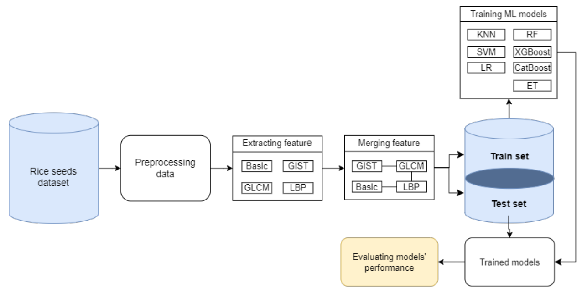

## Leveraging diverse handcrafted features for improved rice seed recognition: A step toward precision agriculture

### Abstract

This project presents a novel approach to rice seed purity recognition, enhancing precision agriculture. By combining multiple feature extraction methods (GIST, LBP, GLCM, and basic features), we create a comprehensive feature set that improves variety classification. Experiments on real-world data show that the CatBoost classifier achieves high accuracy with the combined features, enabling more precise and efficient seed selection in smart farming.

### Methodology

Our system follows a comprehensive and modular pipeline as illustrated in the figure below:



The methodology consists of the following stages:

1. **Data Preprocessing**  
   Images of rice seeds are preprocessed to enhance quality and prepare them for feature extraction.

2. **Feature Extraction**  
   We employ four types of handcrafted features to comprehensively represent the rice seed characteristics:  
   - **Basic Features**: Morphological (size, shape), color (RGB channels), and texture attributes.  
   - **GIST Features**: Capture the overall structure and spatial layout of the seed image.  
   - **GLCM (Gray Level Co-occurrence Matrix)**: Extract texture patterns by analyzing the spatial relationship of pixels.  
   - **LBP (Local Binary Pattern)**: Capture local texture information based on intensity variations.

3. **Feature Fusion**  
   The extracted features (172 dimensions in total) are combined to form a comprehensive feature vector. This fusion helps enhance the classifier's ability by leveraging the strengths of each descriptor.

4. **Machine Learning Models**  
   We train and evaluate several machine learning algorithms, including:  
   - K-Nearest Neighbors (KNN)  
   - Support Vector Machine (SVM)  
   - Random Forest (RF)  
   - Extra Trees (ET)  
   - XGBoost  
   - CatBoost  

   Among them, CatBoost achieves the highest accuracy in rice seed purity classification.

5. **Evaluation**  
   The system is validated on a real-world dataset consisting of six rice seed varieties commonly found in Vietnam. Our approach demonstrates superior performance, with CatBoost reaching an accuracy of up to 96.68%.

### Dataset & Publication

- **Datasets:**

ALL Dataset is available at: https://drive.google.com/drive/folders/1LqkUIPmZRlam6CFkcRR37BznsMHVV2tn.

- **Citation:**

Phan, TTH., Nguyen, L.H.B., Phan, H.H. (2024). Leveraging Diverse Handcrafted Features for Improved Rice Seed Recognition: A Step Toward Precision Agriculture. In: Dao, NN., Pham, QD., Cho, S., Nguyen, N.T. (eds) Intelligence of Things: Technologies and Applications. ICIT 2024. Lecture Notes on Data Engineering and Communications Technologies, vol 230. Springer, Cham.

You may also access the paper: https://doi.org/10.1007/978-3-031-75596-5_6

```
Thi-Thu-Hong Phan, Le Huu Bao Nguyen, Hoang Hung Phan 
```
